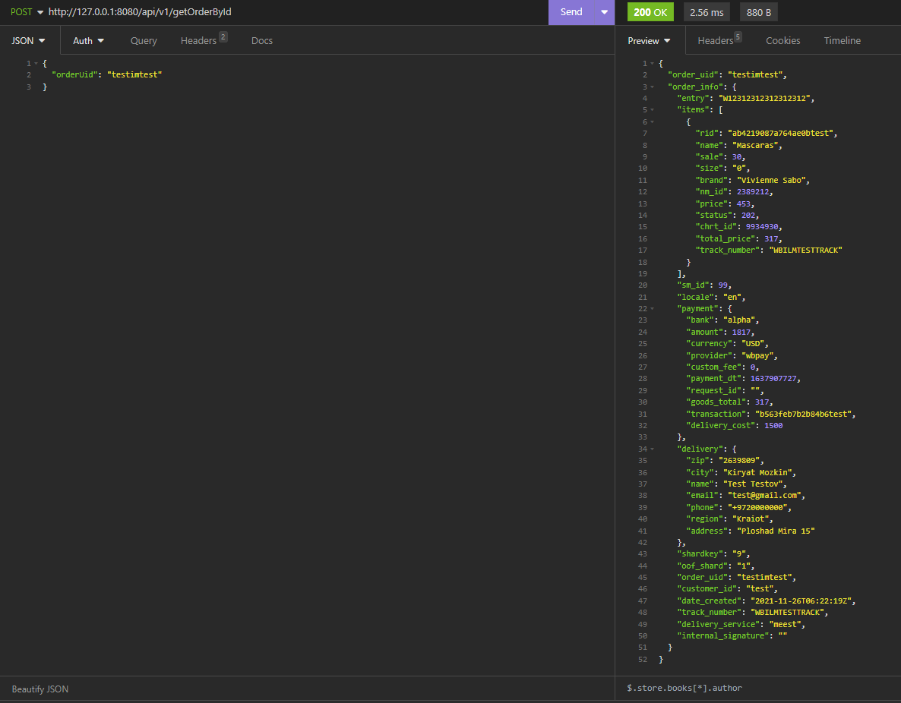

# Nats-streaming wb0

#### !!! Для запуска проекта в корневой папке должен лежать файл config.yaml с такими полями!!!

    Пример:
     httpServer:
            Address: '0.0.0.0:8080'
            CacheSize: '128'
            fillTimeout: '4'
        postgres:
            host: 'название контейнера/aдресс хоста (для этого проекта postgres)'
            user: 'intern'
            dbname: 'wb'
            password: '123'
        natsServer:
            ClusterId: "test-cluster" 
            ClientId: "client-12"
            url: "Название контейнера/адрес хоста (для этого проекта - nats-streaming)"

## Установка

    go mod download

## Старт приложения

     go run .\cmd\main.go    

## Применение миграций 
##### (обязательно сделать "cd migrations" чтобы перейти в папку)
     Для миграций был использован инструмент goose. Чтобы его использовать рекомендуется установить переменные среды:
           GOOSE_DBSTRING=host=0.0.0.0 user=postgres password=postgres dbname=postgres sslmode=disable (с вашими данными бд)
           GOOSE_DRIVER=postgres
           
     Далее можно применять основные команды:
           goose up (применение миграций)
           goose down (откат последней миграции)
           gooose create <название_миграции> sql (создание новой миграции)
           goose status (просмотр примененных миграциий)
    Ленивый запуск - goose postgres "user=postgres dbname=postgres password=postgres sslmode=disable" up or down or create ..

## Запуск в Docker

     docker-compose build
     docker-compose up

# HTTP API

## Handlers

### URL `/api/v1/pullOrder` Method `POST` for imitate producer
    {
    "text":{json}
    }

  

### reply

    ok

### URL `/api/v1/getOrderById` Method `Post`

    {
    "orderUid": "testimtest"
    }

### reply

    {
	"order_uid": "testimtest",
	"order_info": {json}
    }

